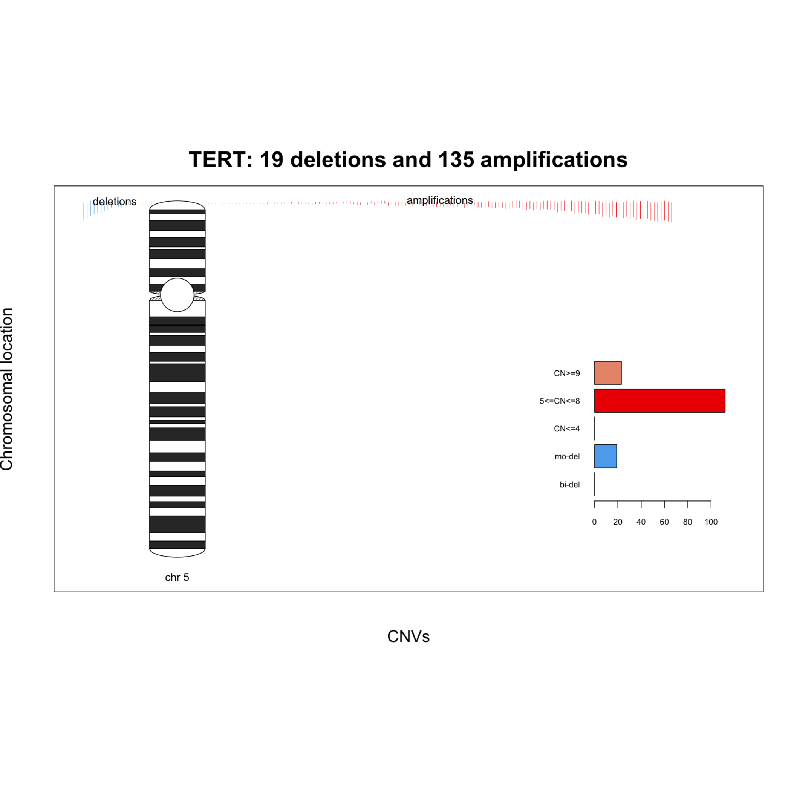
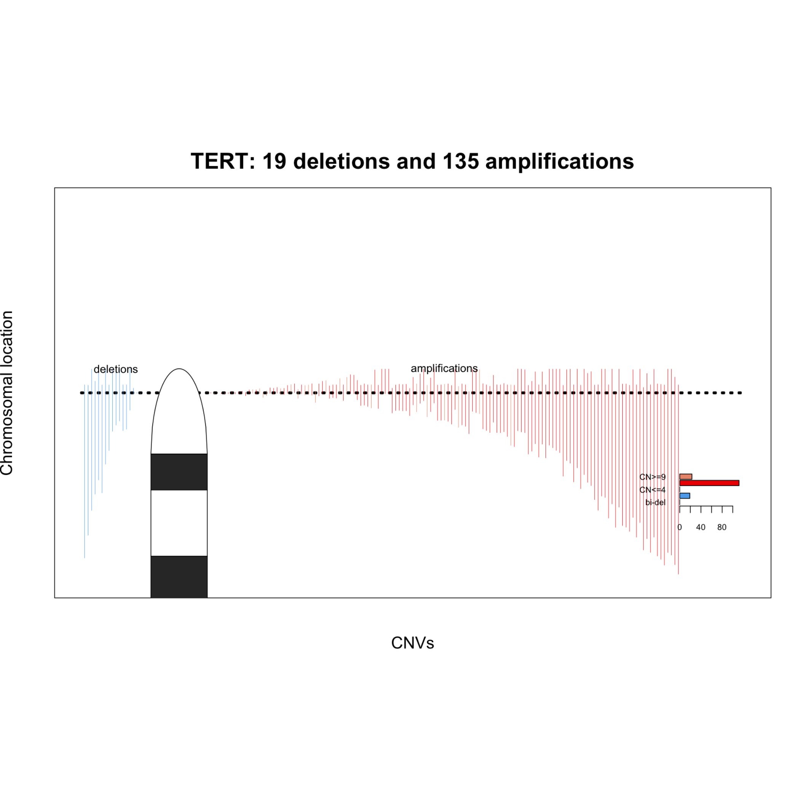

# GenomeTornadoPlot Wrapper

This is a Python wrapper for the [GenomeTornadoPlot](https://github.com/chenhong-dkfz/GenomeTornadoPlot) R script. It streamlines the process of running the GenomeTornadoPlot visualization on a batch of genes based on a provided CSV file.

## Clone with Submodules

Make sure to clone this repository with the `--recurse-submodules` flag to include the necessary submodules:

```bash
git clone --recurse-submodules https://github.com/nicholas-abad/genome-tornado-plot-wrapper.git
```

If you've already cloned without submodules, run:

```bash
git submodule update --init --recursive
```

This will ensure that both `GenomeTornadoPlot/` and `GenomeTornadoPlot-files/` are available.

## Using Conda

To ensure reproducibility and install all necessary dependencies (Python, R, and Bioconductor packages), you can use the provided `environment.yml` file.

### Create and activate the environment:

If you're on Apple Silicon (M1/M2), run:

```bash
CONDA_SUBDIR=osx-64 conda env create -f environment.yml
```

Otherwise:

```bash
conda env create -f environment.yml
```

Then activate it:

```bash
conda activate gtp
```

This sets up the environment with all required packages for both Python and R scripts.

## Repository Structure

```
genome-tornado-plot-wrapper/
├── main.py                     # Main wrapper script
├── _singular_tornado_plot.R   # R script wrapper
├── GenomeTornadoPlot/         # Git submodule
├── GenomeTornadoPlot-files/   # Git submodule
└── README.md
```

## Requirements

- Python 3.x
- pandas
- R with required packages for GenomeTornadoPlot

## Usage

To run the wrapper script:

```bash
python main.py \
  --path-to-csv input.csv \
  --output-folder output/ \
  --delimiter "," \
  --starting-index 0 \
  --ending-index 100
```

### Arguments

- `--path-to-csv`: Path to the input CSV file.
- `--output-folder`: Folder where output plots will be saved.
- `--delimiter`: Delimiter used in the CSV file (e.g., `,`, `\t`).
- `--starting-index`: Start index of the CSV rows to process.
- `--ending-index`: End index of the CSV rows to process.

Ensure the input CSV has at least `#CHROM` and `GENE` columns.

## Examples

Running this `main.py` generates two PNG files: a chromosome-level plot and a zoomed-in version of that plot. An example of each of these can be seen below:

#### Chromosome-level Plot

<p align="center">
   
</p>

#### Zoomed-in Plot

<p align="center">
   
</p>

## License

This wrapper script is based on the original GenomeTornadoPlot by chenhong-dkfz. Refer to their repository for licensing details.
